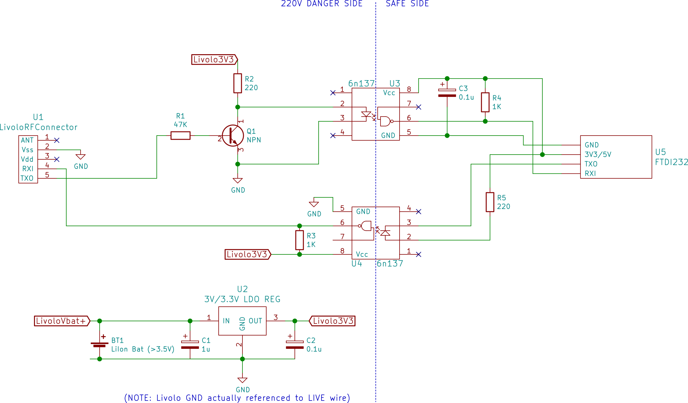

# Firmware for Livolo light switches

I wanted to add on/off feedback and wired remote control to a Livolo switch. Their _brain_ is a PIC16F690, but unfortunately the chip comes code protected, so I had to write this firmware from scratch.

## Features:

 * Serial communication.
 * On/off feedback via UART
 * Remote control via UART
 * 2 wires (TX/RX + GND) for simplex, 3 wires (TX, RX, GND) for duplex comms.
 * Easy to modify: all the extra wires can be soldered to the empty RF through-hole header J6.

## Pull requests welcome 

This is work in progress. I plan to use this and I don't want to set my house on fire, so either if you want to study how the switch works internally or fork it to further work on it, I'd love to hear from suggestions or improvements!

## Supported boards:

 * [VL-C701X-2](https://www.aliexpress.com/item/Free-Shipping-Livolo-Luxury-White-Crystal-Glass-Switch-Panel-EU-Standard-VL-C701-11-110-250V/512886492.html) VER: C0 (1-gang, 1-way, no RF, EU version)

Should be easy to work with this, too:

 * [VL-C702X-2](https://www.aliexpress.com/item/Free-Shipping-White-Crystal-Glass-Switch-Panel-EU-Standard-VL-C702-11-Livolo-AC-110-250V/512770913.html) VER: C1 (2-gang, 1-way, no RF, EU version)

Note that there is no guarantee that buying from these links will get you those versions since they seem to change desings often.

## Working principle

The Livolo switches use a PIC16F690 to detect slight capacitance changes on a glass plate when a finger is pressed against it. The working principle is described in Microchip's AN1101 (recommended read). The differences with regards to the application note are:

 * The output of the C2 comparator is connected to the clock input of Timer 0 instead of Timer 1.
 * The 1/3 voltage divider is replaced with the internal 0.6V reference.
 * The 2/3 voltage divider is replaced with the internal VR reference, which can be configured via VRCON.

## How to use

Once you flash the PIC, there is no coming back!

The Livolo PIC has its CP bit on, which means its flash is unreadable, and thus you can't make a backup copy of the pre-installed firmware. 

Because of this, I recommend replacing the PIC with a blank one. This way you still have a working chip with the original behavior to roll back to.

You need MPLAB X IDE + XC8 compiler. Load up the project, compile and flash.

`config.h` contains a few flags that can be finetuned, ie. the trip and release threshold values.

## Serial connection

Okay, first off the ground traces of the Livolo board (including PIC's GND) are actually referenced to the live wire. **Repeat: GND IS ACTUALLY LIVE, so the challenge here is to be able to talk to a PC without electrocuting yourself**.

I chose to use optocouplers for that. But apparently in the optocouplers world you can only have two of a) cheap, b) low current, c) fast. I had a few 6N137 at hand so I used that. They are cheap, they are fast, but they swallow too much current for Livolo's puny power supply.

So I had to add a battery to provide the extra oomph to light up the diode of one of the OCs and drive the collector of the other, yuck!

Of course this is only valid for debugging to get data out of the PIC. The battery thing makes this inviable for a permanent installation and I'm still looking for other solutions.

Note that I had to bitbang pin RB4 on the PIC for TX out because that PIN is exposed on the empty J6 header along with RX and Vss. That way we have everything we need in J6, which it's through hole and easier to solder on.

If you choose to use the real TX pin, you can track it down to a couple of empty resistor pads, but I found it harder to solder a wire on an SMD pad securely and thus I preferred the bitbang way even if it makes transmission slower.